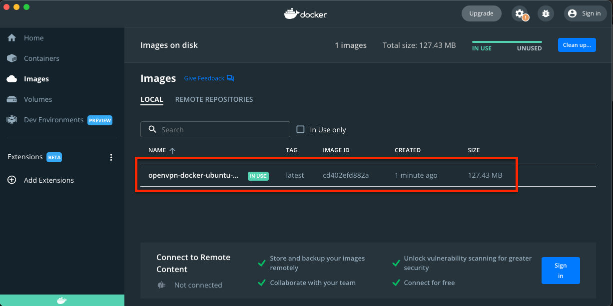
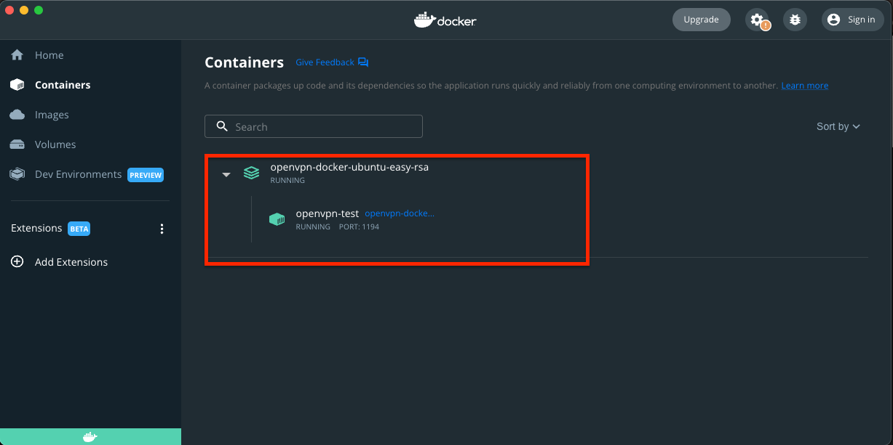

# 🚩 openVPN & easy-rsa

&nbsp;

### 🏁 Langkah-langkah : 

1. Buat Skrip init-easyrsa.sh eksekutabel: <br />
   Pastikan skrip init-easyrsa.sh dapat dieksekusi:
   <pre>
   ❯ chmod +x init-easyrsa.sh
   </pre>

2. Build dan Run Container: <br />
   Jalankan perintah berikut untuk membangun dan menjalankan container:
   <pre>
   ❯ docker-compose up --build
   </pre>
   <pre>
      [+] Building 118.8s (10/10) FINISHED                                                                                                                                                                                   
      => [internal] load build definition from Dockerfile                                                                                               0.0s
      => => transferring dockerfile: 515B                                                                                                               0.0s
      => [internal] load .dockerignore                                                                                                                  0.0s
      => => transferring context: 2B                                                                                                                    0.0s
      => [internal] load metadata for docker.io/library/ubuntu:20.04                                                                                    3.2s
      => CACHED [1/5] FROM docker.io/library/ubuntu:20.04@sha256:0b897358ff6624825fb50d20ffb605ab0eaea77ced0adb8c6a4b756513dec6fc                       0.0s
      => [internal] load build context                                                                                                                  0.0s
      => => transferring context: 37B                                                                                                                   0.0s
      => [2/5] RUN apt-get update &&     apt-get install -y openvpn easy-rsa tree vim &&     apt-get clean &&     rm -rf /var/lib/apt/lists/*           114.8s
      => [3/5] RUN make-cadir /etc/openvpn/easy-rsa                                                                                                     0.1s
      => [4/5] WORKDIR /etc/openvpn/easy-rsa                                                                                                            0.0s 
      => [5/5] COPY init-easyrsa.sh /etc/openvpn/easy-rsa/                                                                                              0.0s 
      => exporting to image                                                                                                                             0.5s 
      => => exporting layers                                                                                                                            0.5s 
      => => writing image sha256:7ad277ba3f552b549c266e29fe481e23beceb155a85ba4f207e10cf6eb68d08a                                                       0.0s 
      => => naming to docker.io/library/openvpn-docker-ubuntu-easy-rsa_openvpn                                                                          0.0s

      Use 'docker scan' to run Snyk tests against images to find vulnerabilities and learn how to fix them
      [+] Running 1/1
      ⠿ Container openvpn-test  Created                                                                                                                 0.1s
      Attaching to openvpn-test
   </pre>

   ⌘ Jangan tutup terminal ini ketika container berhasil dijalankan.

   <div align="center">
      
   </div>

   &nbsp;

   <div align="center">
      
   </div>

3. Masuk ke Container dengan membuka dan dilakukan pada terminal baru: <br />
   Setelah container berjalan, Anda bisa masuk ke dalam container untuk menjalankan skrip inisialisasi:
   <pre>
   ❯ docker images
      REPOSITORY                               TAG       IMAGE ID       CREATED          SIZE
      openvpn-docker-ubuntu-easy-rsa_openvpn   latest    7ad277ba3f55   14 minutes ago   190MB

   ❯ docker ps -a
        CONTAINER ID   IMAGE                                    COMMAND   CREATED          STATUS          PORTS                    NAMES
        8fb69dfc193f   openvpn-docker-ubuntu-easy-rsa_openvpn   "bash"    17 minutes ago   Up 17 minutes   0.0.0.0:1194->1194/udp   openvpn-test
   </pre>
   ### 🔹 Masuk ke dalam Container
   <pre>
   ❯ docker exec -it openvpn-test bash
   </pre>
   Periksa Isi Direktori.
   <pre>
   ....:/etc/openvpn/easy-rsa# <mark>cd /etc/openvpn/easy-rsa</mark>

   ....:/etc/openvpn/easy-rsa# <mark>ls -lah</mark>
      lrwxrwxrwx 1 root root   27 Jun 21 09:47 easyrsa -> /usr/share/easy-rsa/easyrsa
      -rwxr-xr-x 1 root root  279 Jun 21 06:23 init-easyrsa.sh
      -rw-r--r-- 1 root root 4.6K Jun 21 09:47 openssl-easyrsa.cnf
      -rw-r--r-- 1 root root 8.4K Jun 21 09:47 vars
      lrwxrwxrwx 1 root root   30 Jun 21 09:47 x509-types -> /usr/share/easy-rsa/x509-types

   ....:/etc/openvpn/easy-rsa# <mark>tree -L 3 -a ./</mark>
      ./
      |-- easyrsa -> /usr/share/easy-rsa/easyrsa
      |-- init-easyrsa.sh
      |-- openssl-easyrsa.cnf
      |-- vars
      `-- x509-types -> /usr/share/easy-rsa/x509-types

   ....:/etc/openvpn/easy-rsa# <mark>tree -L 4 -a -I 'easy-rsa'  /etc/openvpn</mark>
      /etc/openvpn
      |-- client
      |-- server
      `-- update-resolv-conf

      2 directories, 1 file   
   </pre>
   ⌘ Jalankan Skrip.
   <pre>
   ....:/etc/openvpn/easy-rsa# <mark>./init-easyrsa.sh</mark>
      Note: using Easy-RSA configuration from: ./vars

      init-pki complete; you may now create a CA or requests.
      Your newly created PKI dir is: /etc/openvpn/easy-rsa/pki


      Note: using Easy-RSA configuration from: ./vars

      Using SSL: openssl OpenSSL 1.1.1f  31 Mar 2020
      Generating RSA private key, 2048 bit long modulus (2 primes)
      ........+++++
      ....................................+++++
      e is 65537 (0x010001)
      Can't load /etc/openvpn/easy-rsa/pki/.rnd into RNG
      281473367968224:error:2406F079:random number generator:RAND_load_file:Cannot open file:../crypto/rand/randfile.c:98:Filename=/etc/openvpn/easy-rsa/pki/.rnd
      You are about to be asked to enter information that will be incorporated
      into your certificate request.
      What you are about to enter is what is called a Distinguished Name or a DN.
      There are quite a few fields but you can leave some blank
      For some fields there will be a default value,
      If you enter '.', the field will be left blank.
      -----
      Common Name (eg: your user, host, or server name) [Easy-RSA CA]:
      CA creation complete and you may now import and sign cert requests.
      Your new CA certificate file for publishing is at:
      /etc/openvpn/easy-rsa/pki/ca.crt


      Note: using Easy-RSA configuration from: ./vars

      Using SSL: openssl OpenSSL 1.1.1f  31 Mar 2020
      Generating a RSA private key
      ....................+++++
      .......+++++
      writing new private key to '/etc/openvpn/easy-rsa/pki/private/server.key.sXtcKOiK7S'
      -----
      You are about to be asked to enter information that will be incorporated
      into your certificate request.
      What you are about to enter is what is called a Distinguished Name or a DN.
      There are quite a few fields but you can leave some blank
      For some fields there will be a default value,
      If you enter '.', the field will be left blank.
      -----
      Common Name (eg: your user, host, or server name) [server]:MY-LOCALHOST-TEST

      Keypair and certificate request completed. Your files are:
      req: /etc/openvpn/easy-rsa/pki/reqs/server.req
      key: /etc/openvpn/easy-rsa/pki/private/server.key

      Note: using Easy-RSA configuration from: ./vars

      Using SSL: openssl OpenSSL 1.1.1f  31 Mar 2020

      You are about to sign the following certificate.
      Please check over the details shown below for accuracy. Note that this request
      has not been cryptographically verified. Please be sure it came from a trusted
      source or that you have verified the request checksum with the sender.

      Request subject, to be signed as a server certificate for 1080 days:

      subject=
         commonName                = <mark>MY-LOCALHOST-TEST</mark>

      Type the word 'yes' to continue, or any other input to abort.
      Confirm request details: Using configuration from /etc/openvpn/easy-rsa/pki/safessl-easyrsa.cnf
      Check that the request matches the signature
      Signature ok
      The Subject's Distinguished Name is as follows
      commonName            :ASN.1 12:'MY-LOCALHOST-TEST'
      Certificate is to be certified until Jun  6 07:51:00 2027 GMT (1080 days)

      Write out database with 1 new entries
      Data Base Updated

      Certificate created at: /etc/openvpn/easy-rsa/pki/issued/server.crt

      Note: using Easy-RSA configuration from: ./vars

      Using SSL: openssl OpenSSL 1.1.1f  31 Mar 2020
      Generating DH parameters, 2048 bit long safe prime, generator 2
      This is going to take a long time      
      ...........................................+....+.......+.............
      +.....................................................................
      +.....................................................................
      . . .
      +.....................................................................
      +.....................................................................
      ..........................................................++*++*++*++*

      DH parameters of size 2048 created at /etc/openvpn/easy-rsa/pki/dh.pem
   </pre>
   Periksa kembali **perubahan** isi direktori.
   <pre>
   ....:/etc/openvpn/easy-rsa# <mark>ls -lah</mark>
      lrwxrwxrwx 1 root root   27 Jun 21 09:47 easyrsa -> /usr/share/easy-rsa/easyrsa
      -rwxr-xr-x 1 root root  279 Jun 21 06:23 init-easyrsa.sh
      -rw-r--r-- 1 root root 4.6K Jun 21 09:47 openssl-easyrsa.cnf
      drwx------ 8 root root 4.0K Jun 21 10:16 pki
      -rw-r--r-- 1 root root 8.4K Jun 21 09:47 vars
      lrwxrwxrwx 1 root root   30 Jun 21 09:47 x509-types -> /usr/share/easy-rsa/x509-types   

   ....:/etc/openvpn/easy-rsa# <mark>tree -L 3 -a ./</mark>
      ./
      |-- easyrsa -> /usr/share/easy-rsa/easyrsa
      |-- init-easyrsa.sh
      |-- openssl-easyrsa.cnf
      |-- pki
      |   |-- .rnd
      |   |-- ca.crt
      |   |-- certs_by_serial
      |   |   `-- 3F7D22AF06E676A17433EB24C2647247.pem
      |   |-- dh.pem
      |   |-- extensions.temp
      |   |-- index.txt
      |   |-- index.txt.attr
      |   |-- index.txt.old
      |   |-- issued
      |   |   `-- server.crt
      |   |-- openssl-easyrsa.cnf
      |   |-- private
      |   |   |-- ca.key
      |   |   `-- server.key
      |   |-- renewed
      |   |   |-- certs_by_serial
      |   |   |-- private_by_serial
      |   |   `-- reqs_by_serial
      |   |-- reqs
      |   |   `-- server.req
      |   |-- revoked
      |   |   |-- certs_by_serial
      |   |   |-- private_by_serial
      |   |   `-- reqs_by_serial
      |   |-- safessl-easyrsa.cnf
      |   |-- serial
      |   `-- serial.old
      |-- vars
      `-- x509-types -> /usr/share/easy-rsa/x509-types

      14 directories, 20 files

   ....:/etc/openvpn/easy-rsa# <mark>tree -L 4 -a -I 'easy-rsa'  /etc/openvpn</mark>
      /etc/openvpn
      |-- client
      |-- server
      `-- update-resolv-conf

      2 directories, 1 file   
   </pre>

   &nbsp;

   ### 🔹 Konfigurasi OpenVPN
   Salin file yang diperlukan ke direktori konfigurasi OpenVPN:
   <pre>
   ....:/etc/openvpn/easy-rsa# <mark>cp pki/ca.crt /etc/openvpn/</mark>
   ....:/etc/openvpn/easy-rsa# <mark>cp pki/issued/server.crt /etc/openvpn/</mark>
   ....:/etc/openvpn/easy-rsa# <mark>cp pki/private/server.key /etc/openvpn/</mark>
   ....:/etc/openvpn/easy-rsa# <mark>cp pki/dh.pem /etc/openvpn/</mark>

   ....:/etc/openvpn/easy-rsa# <mark>tree -L 4 -a -I 'easy-rsa'  /etc/openvpn</mark>
      /etc/openvpn
      |-- ca.crt
      |-- client
      |-- dh.pem
      |-- server
      |-- server.crt
      |-- server.key
      `-- update-resolv-conf

      2 directories, 5 files   
   </pre>
   Periksa Sertifikat Server.<br />
   Gunakan perintah openssl untuk memeriksa tanggal kedaluwarsa sertifikat server. Lokasi sertifikat biasanya berada di /etc/openvpn atau direktori yang Anda tentukan dalam konfigurasi.
   <pre>
   ....:/etc/openvpn/easy-rsa# openssl x509 -in /etc/openvpn/server.crt -text -noout | grep "Not After"
         Not After : Jun  6 08:41:50 2027 GMT
   </pre>
   Periksa Sertifikat CA (Certificate Authority).<br />
   <pre>
   ....:/etc/openvpn/easy-rsa# openssl x509 -in /etc/openvpn/ca.crt -text -noout | grep "Not After"
         Not After : Jun 19 07:50:42 2034 GMT
   </pre>
   Periksa Sertifikat Client (Opsional)
   <pre>
   ....:/etc/openvpn/easy-rsa# openssl x509 -in /path/to/client.crt -text -noout | grep "Not After"
         Not After : Jun 21 12:34:56 2025 GMT
   </pre>
   Tanggal ini menunjukkan sampai kapan sertifikat tersebut berlaku. Jika tanggal kedaluwarsa sudah dekat atau telah berlalu, Anda perlu memperbarui sertifikat tersebut.

   &nbsp;

   **Contoh File Konfigurasi Server OpenVPN** <br />
   Buat file konfigurasi server OpenVPN (/etc/openvpn/server.conf) jika belum ada:
   <pre>
   ....:/etc/openvpn/easy-rsa# <mark>vim /etc/openvpn/server.conf</mark>
         . . .
   </pre>
   ```bash
         port 1194
         proto udp
         dev tun
         ca /etc/openvpn/ca.crt
         cert /etc/openvpn/server.crt
         key /etc/openvpn/server.key
         dh /etc/openvpn/dh.pem
         server 10.8.0.0 255.255.255.0
         ifconfig-pool-persist ipp.txt
         keepalive 10 120
         cipher AES-256-CBC
         persist-key
         persist-tun
         status openvpn-status.log
         log-append /var/log/openvpn.log
         verb 3
   ```

   &nbsp;

   ### 🔹 Jalankan OpenVPN Server
   Untuk menjalankan OpenVPN server, gunakan perintah berikut di dalam container:
   <pre>
   ....:/etc/openvpn/easy-rsa# <mark>openvpn --config /etc/openvpn/server.conf</mark>
   </pre>

   &nbsp;

4. Menyalin Sertifikat dan Kunci ke Mesin Klien. <br />
   Dilakukan pada host atau diluar container.
   <pre>
   ❯ docker cp openvpn-test:/etc/openvpn/ca.crt ./ca.crt
   ❯ docker cp openvpn-test:/etc/openvpn/server.crt ./client.crt
   ❯ docker cp openvpn-test:/etc/openvpn/server.key ./client.key   
   </pre>

   &nbsp;

5. Persiapkan File Konfigurasi Client. <br />
   Pastikan Anda memiliki file konfigurasi client OpenVPN (`client.ovpn`). File ini biasanya berisi informasi seperti alamat server, port, path ke sertifikat, dan konfigurasi lainnya. Contoh isi dari client.ovpn bisa seperti ini:
   <pre>
   ❯ vim client.ovpn
      . . .
      client
      dev tun
      proto udp
      remote 192.168.100.225 1194  # Ganti dengan IP server OpenVPN dan port yang digunakan (default 1194)

      resolv-retry infinite
      nobind
      persist-key
      persist-tun

      ca /Users/powercommerce/Documents/test/from-github-all/openVPN-docker-ubuntu-easy-rsa/ca.crt
      cert /Users/powercommerce/Documents/test/from-github-all/openVPN-docker-ubuntu-easy-rsa/client.crt
      key /Users/powercommerce/Documents/test/from-github-all/openVPN-docker-ubuntu-easy-rsa/client.key

      remote-cert-tls server
      cipher AES-256-CBC
      verb 3
   </pre>

   &nbsp;

6. Verifikasi Koneksi. <br />
   Setelah menjalankan perintah di atas, OpenVPN akan mencoba untuk terhubung ke server menggunakan konfigurasi yang diberikan dalam file client.ovpn. Pada output terminal, Anda akan melihat informasi mengenai status koneksi, termasuk jika koneksi berhasil atau jika terdapat masalah yang perlu diperbaiki.


